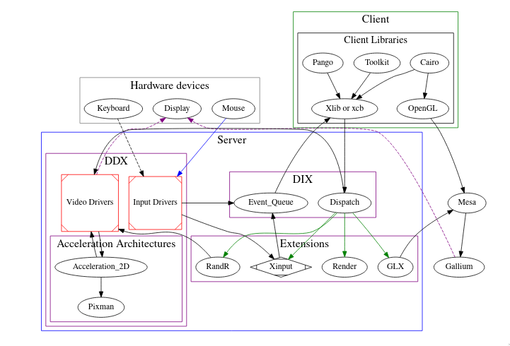

<h1 align="center">xwm</h1>
<p align="center">
  simple x window manager
</p>

<!--  -->

Project to understand the X protocol as well as develop a working window-manager 
built upon it. The goal is to have a low-resource tiling window manager that can attend my needs 
in a minimal and configurable manner. 

Projected features are: 

- [ ] Manual Vertical/Horizontal Tiling 
- [ ] Tiling, Stacked, Mono, Full-screen and Floating Layouts
- [ ] Rules on window creation through regex
- [ ] Keyboard Modes
- [ ] Configuration done through an *rc-file* (lua?)
- [ ] Built-in Status-bar

## Installation
#### Ubuntu/Debian
```sh
sudo apt-get install build-essential cmake
cd build 
cmake .. 
make install
```

#### Arch Linux
```sh
sudo apt-get install base-devel cmake
cd build 
cmake .. 
make install
```

## Development

#### Ubuntu/Debian
```
sudo apt-get install check build-essential cmake libx11-dev xserver-xephyr xinit x11-apps xterm
```

#### Arch Linux
```
sudo pacman -S check base-devel cmake libx11 xorg-server-xephyr xorg-xinit xorg-xclock xorg-xeyes xterm
```

## Targets
Build: 
```sh 
cd build 
cmake ..
make
```

Debug (*development*):
```sh
# not ready yet
make debug
```

Run (*development*):
```sh
# the wm is ran through the Xephyr-Server
make run
```

Test (*development*):
```sh 
# unit-test through https://libcheck.github.io/check/doc/check_html/check_3.html
make test
```

Install:
```sh
make install
```

## License
This project is released under the GNU General Public License 3.0. See [LICENSE](LICENSE).

## Contributions
Please follow the instructions in the contributions guide at [CONTRIBUTING.md](CONTRIBUTING.md).

## Thanks
- [monsterwm](https://github.com/c00kiemon5ter/monsterwm)
- [sowm](https://github.com/dylanaraps/sowm)
- [dwm](https://dwm.suckless.org/tutorial/)

## Donations
I have a ko-fi and a buy-me-a-coffee account, so if you found this repo useful and would like to show your appreciation, feel free to do so!

<p align="center">
<a href="https://ko-fi.com/duclos">

</a>

<a href="https://www.buymeacoffee.com/danielduclos">

</a>

</p>

---
<p align="center">
<a href="https://github.com/duclos-cavalcanti/templates/LICENSE">
  
</a>
<a>
  
</a>
<a>
  
</a>
